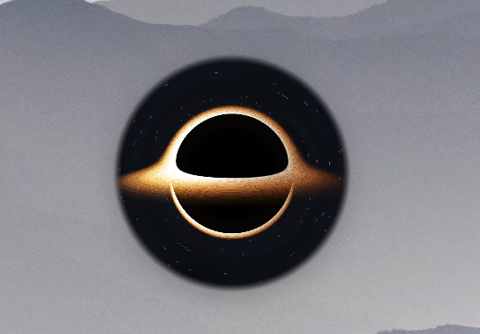

# Kakabin — 桌面黑洞

一个桌面黑洞 widget —— 把文件拖进去，它们就消失在虚空中（系统垃圾桶）。

基于 [Tauri v2](https://v2.tauri.app/)、React、TypeScript 和 Three.js 构建。



## 功能

- **拖拽删除** —— 将任意文件/文件夹拖到黑洞上，自动移入系统垃圾桶
- **粒子物理** —— 轨道粒子系统，模拟潮汐瓦解、引力红移和意大利面化效果
- **桌面层级切换** —— 浮在最顶层或贴到桌面背景层（macOS）
- **右键菜单** —— 打开/清空垃圾桶、切换窗口层级、退出
- **始终置顶** —— 默认在所有窗口之上，也可贴到桌面

## 快速开始

```sh
npm install
npm run tauri dev
```

## 构建

```sh
npm run build          # tsc + vite 构建
npm run tauri build    # 发布包
npm test               # 单元测试
```

## 目录结构

```
src/               前端（React + Three.js）
  lib/             纯逻辑（轨道模拟、拖拽状态机、Tauri IPC）
  hooks/           React 钩子
  components/      黑洞画布（Three.js WebGL）
  shaders/         GLSL 着色器
src-tauri/         Rust 后端（Tauri v2）
  src/lib.rs       命令、菜单、窗口层级
  src/trash_ops.rs 跨平台垃圾回收操作
test/              Vitest 单元测试
```

## 许可

MIT
